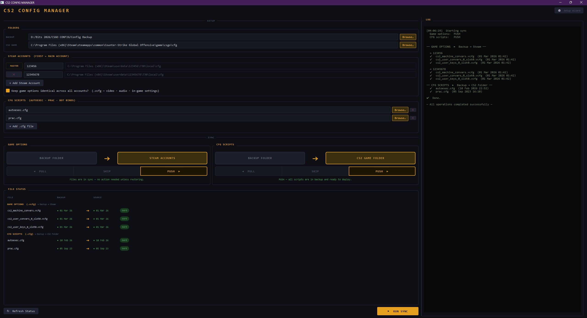

# CS2 Config Manager
**by Pure Mint Software**

A desktop utility for backing up, restoring, and syncing your CS2 configuration files across multiple machines and Steam accounts — with a clean, dark tactical interface.


## App Preview

<p align="center">
  
</p>

## Features

- **Two File Type Awareness** - Handles game-generated `.vcfg` settings and hand-crafted `.cfg` scripts separately, because they flow in opposite directions
- **Pull / Skip / Push Flow Control** - Per-file-type direction toggle with a live visual diagram so you always know what will happen before you click Run
- **File Status Panel** - See at a glance whether every file exists, which side is newer, and whether the operation is safe or risky
- **Multi-Account Sync** - Maintain a master Steam account and push identical settings to any number of secondary accounts on the same PC
- **Overwrite Safety Check** - Warns you before overwriting a newer file with older data, with full timestamps and day-delta shown
- **Setup Wizard** - First-run wizard walks you through your situation (capture, restore, sync, or refresh) and pre-configures the right directions automatically
- **Smart Recommendations** - The app analyses file ages and suggests the correct direction for each file type based on what it finds
- **Cloud-Ready Backup** - Point your backup folder at OneDrive, Dropbox, or Google Drive and your configs travel with you automatically
- **Auto-Save** - Settings are persisted between sessions automatically

## Installation

### Requirements
- Python 3.12 or higher
- Windows or Linux

### Install Dependencies
```bash
pip install PyQt6
```

### Run the Application
```bash
# Run silently (production mode)
pythonw "CS2 Config Manager.pyw"

# Run with console (debug mode)
python "CS2 Config Manager.pyw"
```

> PyQt6 will be installed automatically on first run if it is not already present.

## Usage

### First Run
The Setup Wizard launches automatically. Choose your situation:

| Situation | What it does |
|-----------|-------------|
| **Capture** | Pull game options into backup · Push your scripts to the game |
| **Restore** | Push everything from backup into a fresh CS2 install |
| **Sync** | Pull from master account, push to secondary accounts |
| **Refresh** | Pull game options to capture any new settings added by a CS2 update |

### Flow Control
Each file type has an independent **Pull / Skip / Push** toggle:

- **◄ PULL** — copy from the live location (Steam folder or CS2 game folder) into your backup
- **PUSH ►** — copy from your backup out to the live location
- **SKIP** — leave this file type untouched this run

### File Types

| Type | Extension | Lives in | Typical direction |
|------|-----------|----------|-------------------|
| Game Options | `.vcfg` | Steam userdata folder | Pull once to capture, then Push to restore |
| CFG Scripts | `.cfg` | CS2 game cfg folder | Always Push (you author these, not CS2) |

### Steam Accounts
Add as many Steam accounts as you need. The first row is always the **master** — the source of truth for game options. Secondary accounts receive a pushed copy.

## Data Storage

Settings are stored using the platform's native Qt settings backend:
- **Windows** — registry under `HKCU\Software\Pure Mint Software\CS2 CONFIG MANAGER`
- **Linux** — `~/.config/Pure Mint Software/CS2 CONFIG MANAGER.ini`

No config files are created in the application directory.

## Building Executable (Optional)

To create a standalone `.exe` file:
```bash
pip install pyinstaller
pyinstaller --onefile --windowed --icon=cs2cfg.ico "CS2 Config Manager.pyw"
```

---

**If CS2 Config Manager helps you backup and sync your settings, please give it a star by hitting the button up in the top right corner! ⭐**
